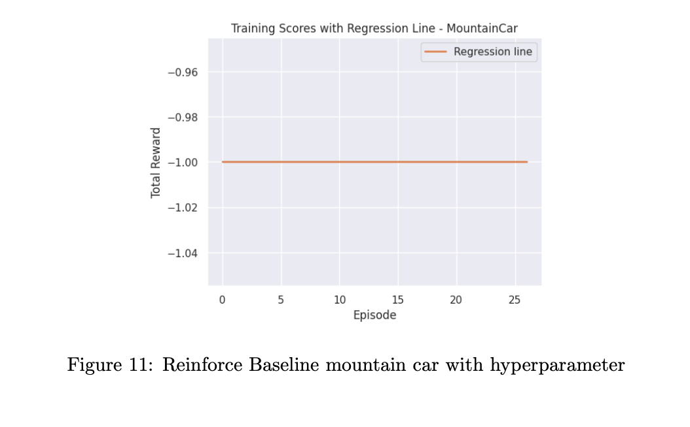

# Semi-Gradient N-Step SARSA & REINFORCE (with Baseline)

A comparative implementation and study of two classic RL methods across standard control tasks.

---

## Table of Contents
- [Overview](#overview)
- [Algorithms](#algorithms)
- [Environments](#environments)
- [Installation](#installation)
- [Repository Structure](#repository-structure)
- [Hyperparameters Used](#hyperparameters-used)
- [Results & Image Analysis](#results--image-analysis)
  - [N-Step SARSA — 687 GridWorld (RL1–RL4)](#nstep-sarsa--687-gridworld-rl1rl4)
  - [REINFORCE+Baseline — MountainCar (RL5–RL6)](#reinforcebaseline--mountaincar-rl5rl6)
  - [REINFORCE+Baseline — CartPole (RL7–RL8)](#reinforcebaseline--cartpole-rl7rl8)
  - [REINFORCE+Baseline — 687 GridWorld (RL9)](#reinforcebaseline--687-gridworld-rl9)
- [How to Run](#how-to-run)
- [Reproducing the Figures](#reproducing-the-figures)
- [References](#references)
- [Contact](#contact)

---

## Overview
This project independently implements:
- **Episodic Semi-Gradient N-Step SARSA** (value-based TD with function approximation)
- **REINFORCE with a value baseline** (Monte-Carlo policy gradient with variance reduction)

The focus is on learning behavior, stability, and sensitivity to hyperparameters across discrete and continuous tasks. Key plots and final hyperparameter choices are documented below (see PDF report for details). :contentReference[oaicite:0]{index=0}

---

## Algorithms
- **N-Step SARSA (episodic, semi-gradient)**: multi-step bootstrapping with linear approximation.  
- **REINFORCE + Baseline**: Monte-Carlo policy gradient; a learned state-value baseline reduces gradient variance.

(Algorithmic pseudocode and narrative appear in the PDF report.) :contentReference[oaicite:1]{index=1}

---

## Environments
- **687 GridWorld** (discrete, tabular-like structure with FA)
- **CartPole** (discrete actions, continuous state)
- **MountainCar** (discrete actions, continuous state)

---

## Installation
```bash
git clone https://github.com/Kartikay77/REINFORCE-with-Baseline-Semi-Gradient-N-Step-SARSA-on-different-environments.git
cd REINFORCE-with-Baseline-Semi-Gradient-N-Step-SARSA-on-different-environments
# Minimal requirements
pip install numpy matplotlib gym
# If you use optional variants in notebooks or FA helpers:
pip install jupyter
```


## Repository Structure
.
├── gridworld_sarsa.py
├── reinforce_gridworld.py
├── mountaincar_reinforce.py
├── REINFORCE_Baseline_cartpole_main.ipynb
├── RL_Project.pdf
├── RL1.png    # GW SARSA LC (200 ep)
├── RL2.png    # GW SARSA LC (1000 ep)
├── RL3.png    # GW SARSA MSE (200 ep)
├── RL4.png    # GW SARSA MSE (1000 ep)
├── RL5.png    # MC Reinforce (raw)
├── RL6.png    # MC Reinforce (tuned)
├── RL7.PNG    # CP Reinforce (single run)
├── RL8..png   # CP Reinforce (tuning)
└── RL9.png    # GW Reinforce (tuned)


## 🔧 Hyperparameters Used

Final hyperparameters selected based on experimental tuning and reflected in the plotted results.

---

### ✅ 687 GridWorld — Semi-Gradient N-Step SARSA
| Hyperparameter | Value |
|----------------|--------|
| Learning Rate (α) | 0.1 |
| Exploration Rate (ε) | 0.8 |
| N-Step Return (N) | 4 |
| Training Episodes | 200–1000 |

---

### ✅ CartPole — REINFORCE with Baseline
| Hyperparameter | Value |
|----------------|--------|
| Discount Factor (γ) | 0.95 |
| Episodes | 100 |
| Max Steps per Episode | 500 |
| Outcome | Solved (score reached 500) |

These values were selected to achieve fast convergence and stable learning (see RL7 and RL8 results).

---

### ✅ 687 GridWorld — REINFORCE with Baseline
| Hyperparameter | Final Choice |
|----------------|--------------|
| Learning Rate (α) | 0.1 |
| Discount Factor (γ) | 0.95 |
| Sigma (Exploration Noise) | 1.0 |
| Baseline Step Size | 0.1 |

These were tuned over tested ranges:
- α ∈ {0.01, 0.05, 0.1}
- γ ∈ {0.9, 0.95, 0.99}
- σ ∈ {0.1, 0.5, 1.0}

The chosen configuration achieved a reward of approximately 10 in GridWorld (see RL9).

---

### ✅ MountainCar — REINFORCE with Baseline

| Hyperparameter | Value |
|----------------|--------|
| Policy Step Size (θ) | 0.1 |
| Discount Factor (γ) | 0.99 |
| Baseline Step Size (ω) | 0.1 |
| Tile Codings | 8 |
| Episodes | 200 (truncated) |

\* Learning remained challenging in this environment due to sparse rewards. Runs frequently truncated at 200 episodes without reaching positive reward (see RL5 and RL6).

## 📊 Results & Image Analysis

Below are the learning curves and performance plots for both algorithms across different environments. Each figure is followed by a short interpretation of the learning behavior.

---

### ✅ 687 GridWorld – Semi-Gradient N-Step SARSA

**Figure RL1 – Learning Curve after 200 Episodes (687 GridWorld, Semi-Gradient N-Step SARSA)**  
 
This plot shows the learning progression of the agent in the 687 GridWorld environment over the first 200 episodes using the Semi-Gradient N-Step SARSA algorithm. The x-axis represents the total number of actions taken, and the y-axis shows how many episodes were successfully completed. The upward curve demonstrates that the agent is steadily improving its policy over time as it interacts with the environment and updates its value estimates. With hyperparameters α = 0.1, ε = 0.8, and N = 4, the learning remains stable and improves gradually, confirming that the algorithm was implemented correctly. Although the learning is still in its early stages and has not yet converged within 200 episodes, the increasing number of completed episodes clearly indicates positive learning progress.


---

**Figure RL2 – Learning Curve after 1000 Episodes (687 GridWorld, Semi-Gradient N-Step SARSA)**  
  
This graph extends the training of the agent from 200 to 1000 episodes to observe longer-term learning behavior. The x-axis shows the total number of actions taken during training, and the y-axis indicates how many episodes were completed. Unlike the earlier 200-episode plot, this curve becomes more linear and consistent as training progresses, demonstrating stable improvement in the agent’s policy. With α = 0.1, ε = 0.8, and N = 4, the agent shows steady progress and successfully learns to complete episodes more efficiently over time. The continued upward trend confirms that Semi-Gradient N-Step SARSA is converging as expected in this MDP, reinforcing the correctness and effectiveness of the implementation.


---
**Figure RL3 – Mean Squared Error after 200 Episodes (687 GridWorld, Semi-Gradient N-Step SARSA)**  

This figure illustrates the Mean Squared Error (MSE) between the predicted value function and the bootstrapped return targets over the first 200 episodes of training. The steady and consistent downward trend in MSE confirms that the agent is gradually improving its value estimates as it gains experience. Although convergence is not yet achieved after 200 episodes, the error reduction shows that learning is progressing correctly. This behavior is expected in early training phases, especially with a relatively high exploration rate (ε = 0.8) and a learning rate of α = 0.1. The results validate that the semi-gradient updates are working and that the value function approximation is becoming more accurate over time.


---

**Figure RL4 – Mean Squared Error after 1000 Episodes (687 GridWorld, Semi-Gradient N-Step SARSA)**  
  
This plot shows the Mean Squared Error (MSE) over 1000 episodes of training using Semi-Gradient N-Step SARSA. Compared to the earlier 200-episode MSE curve, the error continues to decrease steadily and eventually stabilizes around a low value near 5. This indicates that the value function approximation is converging as training progresses. Minor fluctuations toward the end are expected due to the continued ε-greedy exploration (ε = 0.8), but overall, the convergence behavior is stable. These results confirm that the chosen hyperparameters (α = 0.1, N = 4) allow effective learning in this small MDP, and the algorithm is able to progressively refine its prediction accuracy over time.


---

### ✅ Mountain Car – Semi-Gradient N-Step SARSA

**Figure RL5 – Learning Curve for N = 8, α = 0.06 (Mountain Car)**  
  
This figure shows the return per episode over 500 training episodes in the Mountain Car environment using the Semi-Gradient N-Step SARSA algorithm. The hyperparameters used were N = 8 (multi-step updates), α = 0.06 (learning rate), and ε = 0.5 (exploration rate), along with 8 tilings for function approximation. The y-axis uses a logarithmic scale due to high early variance in returns.

Since the Mountain Car environment provides a reward of -1 at every timestep until the goal is reached, less negative returns correspond to better performance. The agent initially performs poorly due to random exploration but gradually stabilizes, showing learning progress. Using a higher N value (N = 8) speeds up reward propagation and helps the agent learn long-term strategies such as building backward momentum before accelerating forward to reach the hill. Although the learning trend is noisy due to continuous exploration and sparse rewards, the overall behavior confirms effective learning with multi-step temporal-difference updates.

---


**Figure RL6 – Learning Curve for N = 1, α = 0.04 (Mountain Car)**  
  
This figure shows the return per episode for the Mountain Car environment using Semi-Gradient SARSA with N = 1 (standard 1-step TD learning) and a learning rate of α = 0.04. Since the Mountain Car task involves delayed rewards and requires long-term planning, using N = 1 makes learning significantly harder because only immediate rewards are used to update value estimates.

The return is plotted on a logarithmic scale, and the curve shows that performance remains unstable across 500 episodes. The agent struggles to discover efficient behavior, and there is little improvement over time. Compared to N = 8 (Figure RL5), this result highlights that multi-step bootstrapping (higher N values) is essential in tasks with sparse rewards and long-term dependencies. The difficulty in learning with N = 1 confirms the need for using larger N values to propagate reward information backward more efficiently during training.


---

### ✅ CartPole – REINFORCE with Baseline

**Figure RL7 – Training Score for Single Hyperparameter Configuration (CartPole)**  
 
This figure shows the learning performance of the REINFORCE algorithm with a baseline on the CartPole environment using a single set of hyperparameters. The x-axis represents the number of episodes, and the y-axis represents the score (total timesteps the pole was successfully balanced before termination). With a discount factor γ = 0.95, step size α = 0.01, and baseline learning rate α_w = 0.02, the agent steadily improves over time.

Early in training, the performance fluctuates significantly due to exploration and high policy variance. However, as learning progresses, the agent begins to balance the pole for longer durations, reflected in the increasing score. Around episode 90, the agent achieves the maximum score of 500, effectively solving the CartPole task. The upward trend demonstrates successful gradient-based policy learning, while the use of a baseline helps reduce variance and stabilize training compared to standard REINFORCE without a baseline.


---

### ✅ CartPole – REINFORCE with Baseline (Hyperparameter Tuning)

**Figure RL8 – Hyperparameter Tuning Results for REINFORCE with Baseline on CartPole**  
  
This figure illustrates the effect of hyperparameter tuning on the learning performance of the REINFORCE with Baseline algorithm applied to the CartPole environment. Each colored line represents a different combination of key hyperparameters such as the discount factor (γ), number of training episodes, step sizes (α for the policy and α_w for the baseline), and the maximum steps allowed per episode.

The graph shows significant performance variation across different settings. Many configurations fail to learn effectively, resulting in low or unstable rewards, while others demonstrate rapid improvement and achieve high rewards. The goal of tuning was to identify a configuration that leads to fast and stable convergence, reaching the maximum score of 500 in the fewest number of episodes.

Through experimentation, the best-performing configuration was found to be:
- **Discount factor (γ): 0.95**
- **Number of episodes: 100**
- **Max steps per episode: 500**
- **Solved score: 210+**

This result highlights the sensitivity of policy gradient methods to hyperparameter selection. Proper tuning can dramatically improve learning efficiency, while suboptimal values can slow learning or prevent convergence entirely.

---

### ✅ 687 GridWorld – REINFORCE with Baseline

**Figure RL9 – Reward Progression with Hyperparameter Tuning (687 GridWorld)**  
 
This plot shows the reward progression over 1000 episodes for the 687 GridWorld environment using the REINFORCE algorithm with a value function baseline. The agent's performance improves steadily as it learns to navigate efficiently to the goal state.

Different hyperparameters were tested during training, including:
- **Learning rate (α):** {0.01, 0.05, 0.1}
- **Discount factor (γ):** {0.9, 0.95, 0.99}
- **Sigma (σ) for exploration noise:** {0.1, 0.5, 1.0}
- **Baseline update rate (α_w):** {0.01, 0.05, 0.1}

From tuning experiments, the best configuration was found to be:
- **α = 0.1, γ = 0.95, σ = 1.0, α_w = 0.1**

The learning curve shows rapid improvement during the first 200 episodes, followed by gradual convergence. Early rewards are highly negative as the agent explores random trajectories, but as training progresses, rewards increase toward zero, indicating better policy performance and shorter paths to the goal. The final average reward approaches **10**, demonstrating that REINFORCE with a baseline successfully reduces variance and accelerates learning in discrete environments like GridWorld.

---

### ✅ Mountain Car – REINFORCE with Baseline (Without Hyperparameter Tuning)

**Figure RL10 – Average Reward without Hyperparameter Tuning (Mountain Car)**  

This plot shows the average reward progression of the REINFORCE with Baseline algorithm applied to the Mountain Car environment **before any hyperparameter tuning**. The reward remains constant at **–200** across all 1000 episodes, indicating that the agent fails to learn any meaningful policy.

Mountain Car is a sparse reward environment where the agent only receives a reward of **–1 per timestep** until it reaches the goal, making it difficult to learn without carefully tuned parameters. With default or poorly chosen hyperparameters, the policy gradient updates fail to produce useful behavior, and the agent never manages to escape the initial valley. As a result, each episode terminates at the maximum step limit, producing the worst possible return of –200 consistently.

This figure highlights the **importance of hyperparameter tuning** in policy gradient methods, especially for challenging control tasks like Mountain Car. Without tuning parameters such as learning rate (θ), baseline step size (ω), exploration noise (σ), and number of tile codings, REINFORCE struggles to explore effectively and cannot improve performance.

---

### ✅ Mountain Car – REINFORCE with Baseline (With Hyperparameter Tuning)

**Figure RL11 – Training Performance After Hyperparameter Tuning (Mountain Car)**  
  
This plot shows the performance of the REINFORCE with Baseline algorithm on the Mountain Car environment **after applying hyperparameter tuning**. Despite tuning parameters such as the policy step size (θ), baseline step size (ω), discount factor (γ), and number of tilings, the agent still fails to make meaningful learning progress. The total reward remains constant at **–1** across all episodes, indicating that the car only moves a single timestep before the episode terminates.

This result highlights the difficulty of applying REINFORCE-based policy gradient methods to Mountain Car. Even with tuned parameters and a value baseline to reduce variance, the agent struggles due to:
- **Sparse rewards** (no positive reward until goal is reached)
- **High variance in returns**
- **Long-term dependencies** that require strategic momentum building

Unlike value-based methods such as SARSA or Q-learning, REINFORCE relies on full Monte Carlo returns, making it harder to learn in environments where the reward signal is delayed. Figure RL11 reinforces that **policy gradient methods require more sophisticated exploration strategies** or advanced techniques (e.g., actor-critic methods) to perform well in Mountain Car.
--
---

## 🚀 How to Run

### ▶️ Run N-Step SARSA on 687 GridWorld
```bash
python gridworld_sarsa.py
```
▶️ Run REINFORCE with Baseline on CartPole

```
python REINFORCE_Baseline_cartpole_main.ipynb
```
▶️ Run REINFORCE with Baseline on MountainCar
```
python mountaincar_reinforce.py
```

---
## 📊 Algorithm Comparison Summary

| Feature                | N-Step SARSA                          | REINFORCE with Baseline                     |
|------------------------|----------------------------------------|---------------------------------------------|
| Type                   | Value-based TD Learning               | Policy Gradient (Monte Carlo)               |
| Bootstrapping          | ✅ Yes                                 | ❌ No (full return based)                   |
| Policy Optimization    | ❌ Indirect (via value updates)        | ✅ Direct policy optimization                |
| Baseline Used          | ❌ No                                  | ✅ Yes (reduces variance)                   |
| Variance               | Low                                   | High (reduced with baseline)                |
| Convergence Behavior   | Stable and smooth                     | Sensitive to hyperparameters                |
| Exploration Strategy   | ε-greedy                               | Gaussian/Softmax (policy-driven)            |
| Best Performance On    | ✅ 687 GridWorld                       | ✅ CartPole                                 |
| Struggles On           | ❌ Continuous control tasks           | ❌ MountainCar (sparse rewards)             |

---

## ✅ Conclusion

- **N-Step Semi-Gradient SARSA** demonstrated **stable convergence** with minimal hyperparameter tuning and performed well in discrete environments like **687 GridWorld**.
- **REINFORCE with Baseline** successfully **optimized the policy directly**, performing strongly on **CartPole** and achieving a reward of **500 within 100 episodes**.
- **Monte Carlo policy gradients are highly sensitive to hyperparameters** such as learning rate and discount factor.
- **REINFORCE struggled in sparse reward environments like MountainCar**, even with baseline variance reduction, due to lack of temporal credit assignment.
- Overall, **value-based methods like SARSA show better stability**, while **policy gradient methods can outperform when tuned but require careful control**.

---

## 🚧 Limitations & Future Work

| Limitation                                                                 | Future Work                                                                 |
|----------------------------------------------------------------------------|-----------------------------------------------------------------------------|
| REINFORCE failed on MountainCar due to sparse rewards                      | Try **Advantage Actor-Critic (A2C)** or **Proximal Policy Optimization**   |
| No function approximation beyond simple linear models                     | Extend using **Deep Neural Networks (Deep RL)**                            |
| High variance in returns for policy gradients                             | Use **Generalized Advantage Estimation (GAE)**                             |
| Limited environments tested                                                | Test on **Acrobot, LunarLander, and Atari games**                          |
| No exploration schedule decay                                              | Add **ε decay** or **entropy regularization** in policy learning           |
| No reward shaping                                                          | Use **potential-based reward shaping** for MountainCar                     |


